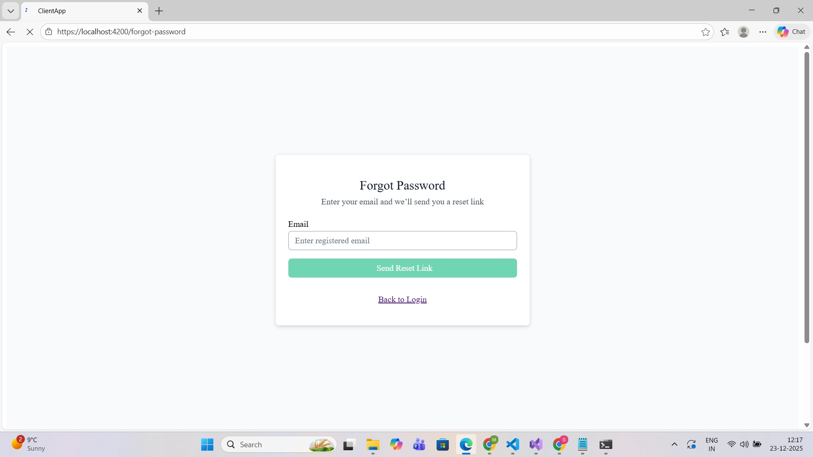
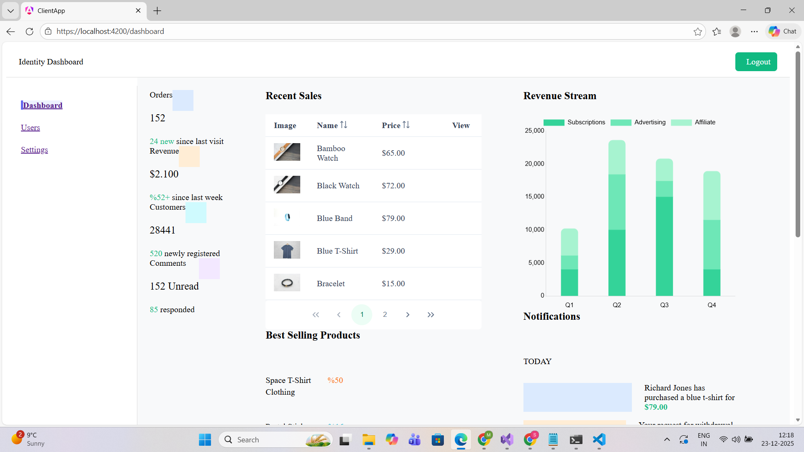
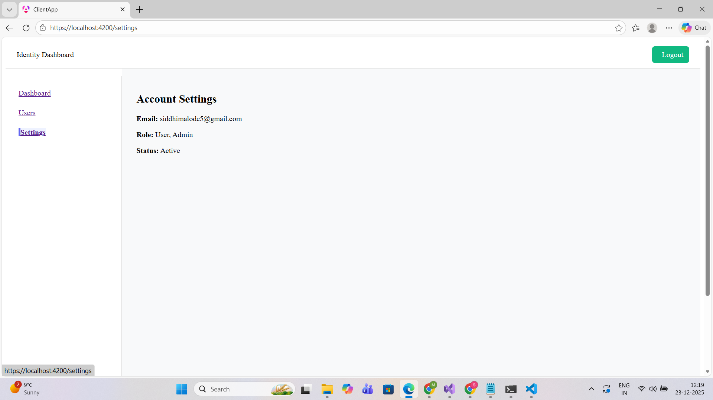

# IdentityApp 🔐

IdentityApp is a **full-featured authentication and user management system** built with **ASP.NET Core 8** and **Angular**. It includes:

- Secure email/password login  
- External login with **Google** and **Facebook**  
- Email verification and password recovery  
- Role-based access control (**Admin vs Regular Users**)  
- JWT & cookie-based authentication  
- Responsive admin dashboard using **PrimeNG**  
- Frontend route protection with **Angular AuthGuard**  
- **Users Management tab visible only to Admin users**

---

## 📑 Table of Contents

- Project Overview  
- Features  
- Technologies Used  
- Folder & File Structure  
- Setup & Installation  
- Usage  
- Authentication & Role Flow  
- Security  
- Screenshots  
- Note  

---

## 📌 Project Overview

IdentityApp provides a **secure and extendable authentication system** for web applications.

- Users can register, log in, and manage their accounts  
- Admins can manage users, roles, and application settings  

### 🎯 Key Goals

- Email/password authentication  
- External login via Google and Facebook  
- Email verification and forgot password flows  
- Role-based admin dashboard  
- Frontend route protection using Angular AuthGuard  
- JWT and cookie-based authentication  
- Improved UI using PrimeNG  

---

## ✨ Features

### 🔐 User Authentication

- Email/password login & registration  
- External login via **Google** and **Facebook**  
- Email verification for new users  
- Forgot password & reset password functionality  

---

### 🛠️ Admin Dashboard

- Manage users: **view, delete, or change roles**  
- Access admin-only pages (Users tab, settings)  
- Role-based access for sensitive actions  

---

### 🧱 Frontend Security

- Angular route guards (**AuthGuard**)  
- Role checks for protected routes  
- Redirect unauthorized users to login  

---

### 🎨 UI / UX

- Dashboard and settings pages  
- PrimeNG components for responsive and polished UI  
- Clean and intuitive interface  

---

## 🧰 Technologies Used

| Layer          | Technology |
|---------------|------------|
| Backend       | ASP.NET Core 8, C#, Entity Framework Core |
| Frontend      | Angular, TypeScript, PrimeNG |
| Database      | SQL Server (or SQLite) |
| Authentication| JWT, Cookies, OAuth 2.0, ASP.NET Identity |
| Email         | MailJet API (email verification & password reset) |

---

## 📁 Folder & File Structure
```text
IdentityApp/
├── Controllers/       # AuthController, UsersController
├── Models/            # User, Role, DTOs
├── Services/          # AuthService, EmailService
├── Data/              # ApplicationDbContext
├── Program.cs         # Application startup configuration
├── appsettings.json   # Database, MailJet & OAuth credentials
├── Frontend/          # Angular app (components, services, guards)
└── README.md
```
## 🚀 Setup & Installation

### Backend

```bash
git clone https://github.com/<username>/IdentityApp.git
cd IdentityApp
dotnet restore

```


## ⚙️ Backend Configuration

Update `appsettings.json` with:

- **Database connection string**
- **MailJet credentials**
- **Google & Facebook OAuth credentials**

Run the backend:

```bash
dotnet run

---

## 🧑‍💻 Frontend

```bash
cd Frontend
npm install
ng serve


Frontend runs on: http://localhost:4200

Backend runs on: http://localhost:7008
 (or configured port)

---

## 🧪 Usage

- Register with email/password or external login  
- Verify your email via the link sent by **MailJet**  
- Log in to access the dashboard  

### 👑 Admin Users

- Manage users  
- Change roles  
- Access admin-only pages  

### 👤 Regular Users

- Can access allowed pages only  

---

## 🔄 Authentication & Role Flow

1. Registration → Email verification  
2. Login → JWT token & cookie stored in browser  
3. Angular **AuthGuard** checks:
   - Login status  
   - User roles  
4. Admins access additional endpoints and dashboard features  

---

## 🔐 Security

- Passwords hashed using **ASP.NET Identity**  
- JWT tokens used for secure API access  
- Role-based access control for endpoints  
- OAuth integration with **Google** and **Facebook**  
- Email verification and password reset flows  
 
 ## 🖼️ Screenshots

### 🔐 Login Page


### 🔐 Register Page


### 🔐 Forgot Password Page


### 📊 Admin Dashboard


### 👥 Users Management


### ⚙️ Settings Page



## 📝 Note

🚧 **This project is under active development.**  
Additional features, security enhancements, and UI improvements are planned.

 
 


 
